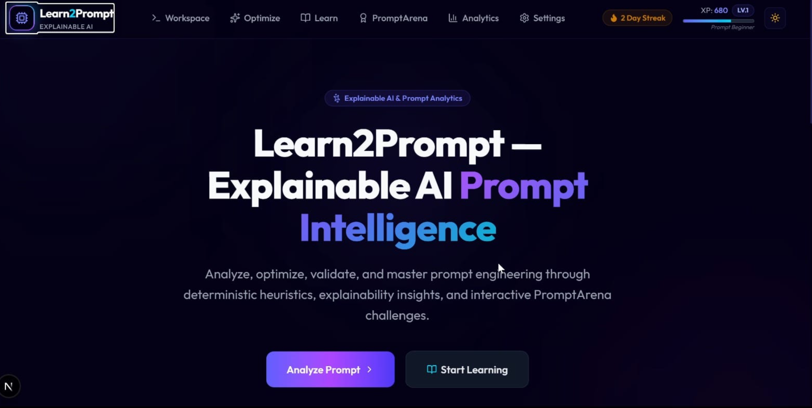

# 🚀 Learn2Prompt

> Learn2Prompt is an AI-powered educational platform that helps users learn Prompt Engineering through structured tutorials, practical examples, and interactive exercises.

---

## 📖 About

Prompt Engineering has become an essential skill for working effectively with AI tools like ChatGPT, Gemini, Claude, and other Large Language Models.

Learn2Prompt provides a beginner-friendly learning experience where users can understand prompting techniques, practice with examples, and improve their AI communication skills through an intuitive web interface.

---

## ✨ Features

- 📚 Prompt Engineering Tutorials
- 🤖 AI-powered Learning Experience
- 📝 Interactive Prompt Examples
- 🎯 Practice Exercises
- 🔐 User Authentication
- 📱 Responsive Design
- ⚡ Fast Performance
- 🌙 Modern User Interface

---

## 🛠 Tech Stack

- Next.js
- React
- TypeScript
- Tailwind CSS
- Firebase
- Google Gemini API

---

## 📸 Preview

<p align="center">
  
</p>

---

## 🚀 Getting Started

First, install dependencies:

```bash
npm install
```

Run the development server:

```bash
npm run dev

# or

yarn dev

# or

pnpm dev

# or

bun dev
```

Open **http://localhost:3000** with your browser to view the application.

You can start editing the project by modifying:

```
app/page.tsx
```

The page updates automatically as you make changes.

---

## 📂 Project Structure

```text
Learn2Prompt/
│
├── app/
├── components/
├── public/
├── docs/
├── lib/
├── firebase/
├── styles/
└── README.md
```

---

## 👥 Project Team

This project was collaboratively designed and developed by:

- Hrishikesh Adep
- Prem Ashtekar
- Abhishek Jadhav
- Abhay Gunjal

---

## 📚 Learn More

To learn more about Next.js, visit the following resources:

- [Next.js Documentation](https://nextjs.org/docs)
- [Learn Next.js](https://nextjs.org/learn)

You can also explore the official [Next.js GitHub repository](https://github.com/vercel/next.js).

---

## 🚀 Deployment

The easiest way to deploy this project is through the **Vercel Platform**.

For more details, refer to the official Next.js deployment documentation:

https://nextjs.org/docs/app/building-your-application/deploying

---

⭐ If you like this project, consider giving it a star for sure !
